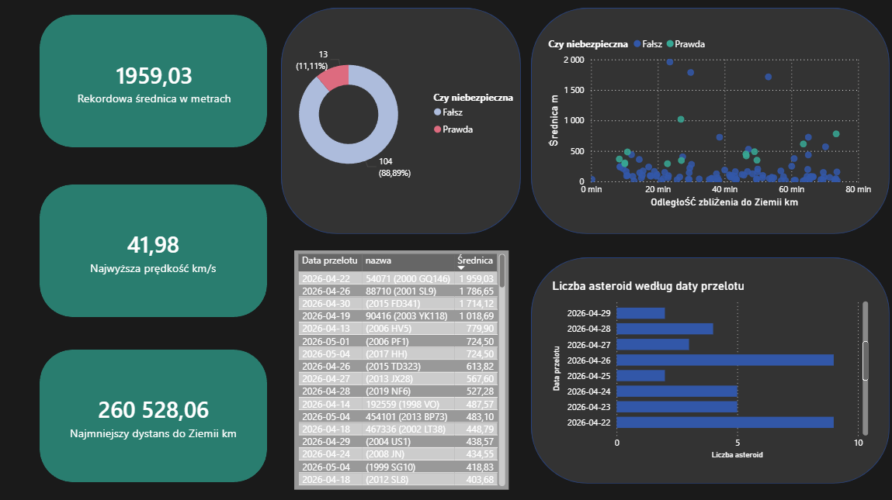

# NEOFlow_ETL

NEOFlow_ETL to zautomatyzowany rurociąg danych, który śledzi obiekty bliskie Ziemi (NEO). Skrypt codziennie pobiera parametry fizyczne asteroid z API NASA, przetwarza je i ładuje do relacyjnej bazy danych, budując zbiór pod analizę i wizualizację.

## Wykorzystane technologie
* Język: Python 
* Przetwarzanie danych: Pandas
* Baza danych: PostgreSQL (SQLAlchemy, psycopg2)
* Wizualizacja: Power BI
* Automatyzacja: Skrypt wsadowy (.bat) zintegrowany z Harmonogramem zadań Windows

## Architektura procesu 
1. Extract: Skrypt łączy się z endpointem api.nasa.gov i pobiera surowe dane w formacie JSON dla bieżącego dnia.
2. Transform: Przy użyciu biblioteki Pandas dane są spłaszczane, a jednostki standaryzowane (m.in. przeliczenie średnicy na metry, prędkości na km/s). Wyciągane są tylko kluczowe parametry fizyczne i identyfikacyjne.
3. Load: Oczyszczona ramka danych jest dodawana do lokalnej bazy PostgreSQL, co pozwala na budowanie stałej historii przelotów.

## Uruchomienie projektu lokalnie

1. Sklonuj repozytorium na swój dysk.
2. Zainstaluj wymagane pakiety:
   `pip install -r requirements.txt`
3. W głównym katalogu projektu stwórz plik `.env` i uzupełnij go zmiennymi środowiskowymi:
   ```text
   API_KEY=twoj_klucz_z_api_nasa
   DB_HOST=localhost
   DB_PORT=5432
   DB_USER=postgres
   DB_PASSWORD=twoje_haslo
   DB_NAME=astroflow


   ------------------------------------------------------------------------------------------------------------------------------------------------------------------------------

# NEOFlow_ETL

NEOFlow_ETL is an automated data pipeline tracking Near Earth Objects. The script daily fetches physical parameters of asteroids from the NASA API, processes them, and loads them into a relational database, building a historical dataset for analysis and visualization.

## Technologies Used
* Language: Python 
* Data Processing: Pandas
* Database: PostgreSQL, SQLAlchemy, psycopg2
* Visualization: Power BI
* Automation: Batch script integrated with Windows Task Scheduler

## ETL Process Architecture
1. Extract: The script connects to the api.nasa.gov endpoint and fetches raw JSON data for the current day.
2. Transform: Using the Pandas library, the data is flattened and units are standardized, such as converting diameter to meters and velocity to kilometers per second. Only key physical and identification parameters are extracted.
3. Load: The cleaned dataframe is appended to a local PostgreSQL database, allowing for the construction of a continuous history of flybys.

## Running the project locally

1. Clone the repository to your local drive.
2. Install the required packages:
   pip install -r requirements.txt
3. In the root directory of the project, create a .env file and populate it with your environment variables:
   ```text
   API_KEY=your_nasa_api_key
   DB_HOST=localhost
   DB_PORT=5432
   DB_USER=postgres
   DB_PASSWORD=your_password
   DB_NAME=astroflow
